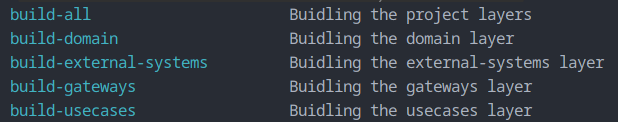

# yt_dlpify

YouTube downloader around the usage of yt_dlp tool but with clean architecture and modular components

---

## The Why

### Well i want to make a nice small tool for downloading YouTube videos and that tool is written in a clean way so i can demonistrate my skills in

- System design
- System architecture
- System clean code
- System readability
- System testability

---

## The How

### I have this project then helping me achieving the why i stated above which will contains several components that will be doing several functionalities in a clean architecture sort of codebase here 😁

---

## The What

### Since i'm trying to apply the clean architecture <https://blog.cleancoder.com/uncle-bob/2012/08/13/the-clean-architecture.html> so the projects has (4) components/layers [for now]

- domain
  - The most inner circle of clean architecture
  - This is the domain layer for the project and it should contain anything related to the core functionality/domain of this project
  - This should contain core entities like [DomainContent, DomainTag, etc ...] and variation of those domain entities that is related to core functionalities
- usecases
  - The next layer on top of the domain layer and it can use anything from the inner layers [domain layer only in this case]
  - This layer will be providing two things
    - Interfaces for any type of external components that will be needed to achieve a specific functionality/usecase, for example downloading a youtube video from a url will need an implementation of the YouTubeVideoDownloaderInterface to be used to achieve this functionality, in this way i'm not specifically depending on one framework or implementation to download videos from youtube however i can accept any type of youtube-downloaders as long as they are implementing this layer's YouTubeVideoDownloaderInterface that this usecase is expecting, the same will apply for any other stuff like database interactions wich will implement RepositoryInterface(s) and so on for any other usecases.
    - The usecases iteself (logic) for specific functionalities

- gateways
  - The next layer on top of the usecase layer and it can use anything from the inner layers [domain layer and usecases layer only in this case].
  - This layer will be providing one thing
    - The implementation of the interfaces needed for the usecases to be used so for example we can find here an implementation of YouTubeVideoDownloaderInterface and also an implementation for database(s) of the RepositoryInterface(s)

- external_systems
  - The next layer on top of the gateways layer and it can use anything from the inner layers [domain layer, usecases layer and gateways layer in this case].
  - This layer will be providing
    - Any type of external components needed like Rest-API, Filesystem interactions, GUI application or any sort of enclosure(s) that will be using the usecases we defined in the inner layers.

---

## Building the layer

### Prerequisites

- I'm using ([Make](https://www.gnu.org/software/make/)) build tool to make things easier, so please follow the instructions to be ready with Make on your operating system
- I'm currently using ([Python v3.12](https://www.python.org/)), so please follow the instructions to be ready with Make on your operating system
- I'm using ([Poetry](https://python-poetry.org/)) package manager for python, so please follow the instructions to be ready with Make on your operating system

### Usage

- `$ make` # This will show you what's available for you to do in the layer, currently only building the package in this case

- `$ make build` # This will build the package(s) for all the layers

---
