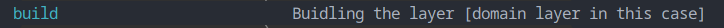

# Domain layer

## This layer provides the followings

- [X] Entities
  - [X] Errors
    - [X] GenericError
    - [X] YouTubeVideoDownloadError
    - [X] YouTubeVideoMetadataFetchingError
  - [X] Video
    - [X] YouTube
      - [X] ToBeDownloadedYouTubeVideo
      - [X] ToBeMetadataFetchedYouTubeVideo
      - [X] DownloadedYouTubeVideo
      - [X] YouTubeVideoFormat
      - [X] YouTubeVideoMetadata
    - [X] OnProgressStatus
    - [X] OnCompletionStatus

---

## Building the layer

### Prerequisites

- I'm using ([Make](https://www.gnu.org/software/make/)) build tool to make things easier, so please follow the instructions to be ready with Make on your operating system
- I'm currently using ([Python v3.12](https://www.python.org/)), so please follow the instructions to be ready with Make on your operating system
- I'm using ([Poetry](https://python-poetry.org/)) package manager for python, so please follow the instructions to be ready with Make on your operating system

### Usage

- `$ make` # This will show you what's available for you to do in the layer, currently only building the package in this case

- `$ make build` # This will build the package
  
---
