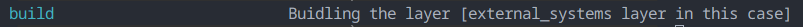

# Usecases layer

## This layer provides the followings

- [X] Cli App
  - [X] Arg Parse Implementation (Builtin-python module usage)
    - [X] Download YouTube Video From An Url

---

## Building the layer

### Prerequisites

- I'm using ([Make](https://www.gnu.org/software/make/)) build tool to make things easier, so please follow the instructions to be ready with Make on your operating system
- I'm currently using ([Python v3.12](https://www.python.org/)), so please follow the instructions to be ready with Make on your operating system
- I'm using ([Poetry](https://python-poetry.org/)) package manager for python, so please follow the instructions to be ready with Make on your operating system

### Usage

- `$ make` # This will show you what's available for you to do in the layer

- `$ make build` # This will build the package and before that will run the test-coverage to make sure everything is fine
- `$ python "external_systems/cli_app/arg_parse_implementation/download_youtube_video_from_url.py" -u "https://www.youtube.com/watch?v=zGDzdps75ns" -r 144 -d "/tmp"` # Downloading a video from a url in 144P

---
