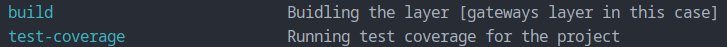

# Gateways layer

## This layer provides the followings

- [X] Implementations
  -

---

## Building the layer

### Prerequisites

- I'm using ([Make](https://www.gnu.org/software/make/)) build tool to make things easier, so please follow the instructions to be ready with Make on your operating system
- I'm currently using ([Python v3.12](https://www.python.org/)), so please follow the instructions to be ready with Make on your operating system
- I'm using ([Poetry](https://python-poetry.org/)) package manager for python, so please follow the instructions to be ready with Make on your operating system

### Usage

- `$ make` # This will show you what's available for you to do in the layer

- `$ make build` # This will build the package and before that will run the test-coverage to make sure everything is fine
- `$ make test-coverage` # This will run the test-coverage for the project to make sure that everything is passing and green

---
